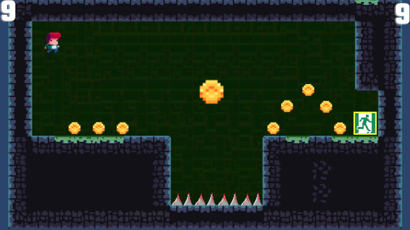
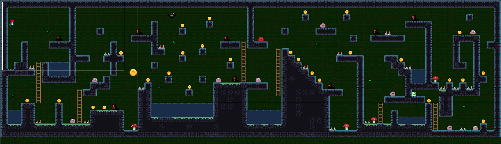

My Third Unity 2D game
# EscapeVania

## About The Game
Overview
This is a 2D Unity game where the player can shoot enemies, collect coins, double jump, and avoid water and spikes. The player has 2 lives and a score that is kept track of. There are currently 3 levels, 3 different types of enemies, ladders to climb, and mushrooms that help the player jump higher. The camera dynamically follows the player and zooms in or out when the player is on a ladder.

## Key Features
Dynamic Gameplay: Engage in a world where you can double jump to reach higher platforms, shoot enemies with precision, and avoid water and spikes that pose deadly hazards.

Interactive World: Climb ladders, bounce higher on mushrooms, and navigate through an interactive environment designed to test your platforming skills.

Enemy Variety: Encounter three different types of enemies, each with unique colors and sizes, adding depth and challenge to the game.

Dynamic Camera: Experience a camera system that follows the player's movements, zooming in and out seamlessly when climbing ladders for an immersive experience.
Score and Lives: Keep track of your high score while managing your two precious lives as you progress through the levels.

Control Scheme: Simple and intuitive controls — use the spacebar to jump and the 'X' key to shoot.

Multiple Levels: Explore and conquer three intricately designed levels, each with its own set of challenges and enemies.

## Controls
-** Move: Arrow keys
-** Jump: Spacebar (Double jump enabled)
-** Shoot: 'X' key

## Development Learnings
Throughout the development of this game, a plethora of Unity 2D features were explored and utilized, showcasing the robust capabilities of the engine:

Prefabs: Efficiently reuse game objects and maintain consistency across levels.
Animator and Animation Controller: Bring characters and objects to life with smooth and responsive animations.
Scripting: Control game mechanics and behaviors with well-structured C# scripts.
Physics: Simulate realistic movements and interactions with Unity's physics system.
Camera Control: Implement a camera that adapts to player actions, enhancing gameplay and visual appeal.
UI: Design a user-friendly interface to display scores and lives.
Level Design: Create diverse and engaging levels that offer a variety of gameplay experiences.

## Level 1

## Level 3

## Player In Action, Hit The Enemy

## Player die and respawn

## Level Transition

## Mushroom Jump!

## Authors
- **Kevin Yang** - *Initial work* - [kevinYang0612](https://github.com/kevinYang0612)
